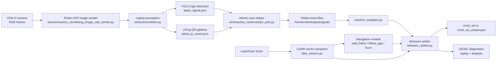

# TurtleBot 4 Reactive Perception and Navigation

Safety-first TurtleBot 4 stack that combines LiDAR reactive navigation, YOLO traffic-sign events, QR checkpoint logging, and finite-state behavior arbitration for indoor autonomous-robot experiments.

> Status: research/competition prototype. The repository emphasizes reproducible iteration, diagnostics, and real-robot evidence, not a production-ready navigation stack.

## Problem

The project targets an unknown indoor course where a TurtleBot 4 Lite must:

- navigate from local sensor evidence without relying on a prebuilt map;
- react to visual traffic signs such as left, right, and stop;
- detect and persist QR checkpoint content;
- avoid unsafe motion when LiDAR, camera, or perception signals are missing, stale, or contradictory;
- preserve logs that make failures replayable offline.

The core engineering challenge is not only detecting objects or commanding motion; it is making perception, navigation, and safety arbitration observable enough to debug after real robot runs.

## System overview



The project deliberately separates suggestions from final control:

- perception modules produce symbolic events;
- navigation modules propose commands;
- the arbiter owns the final command and safety decision;
- offline scripts never publish `/cmd_vel`.

## Behavior arbitration priority

The active robot controller follows this priority order:

1. Emergency LiDAR stop / collision prevention
2. Active maneuver completion, unless emergency stop is needed
3. QR scan/checkpoint registration behavior
4. Confirmed traffic-sign command
5. Default LiDAR navigation
6. Safe idle/stop when required sensors are missing or stale

This priority is encoded and tested around [ubuntu/reactive_nav/behavior_arbiter.py](ubuntu/reactive_nav/behavior_arbiter.py) and [ubuntu/reactive_nav/reactive_navigator.py](ubuntu/reactive_nav/reactive_navigator.py).

## Main components

| Area | Files |
| --- | --- |
| Robot controller / FSM | [ubuntu/reactive_nav/reactive_navigator.py](ubuntu/reactive_nav/reactive_navigator.py), [ubuntu/reactive_nav/behavior_arbiter.py](ubuntu/reactive_nav/behavior_arbiter.py) |
| LiDAR preprocessing | [ubuntu/reactive_nav/lidar_sectors.py](ubuntu/reactive_nav/lidar_sectors.py) |
| Navigation modules | [ubuntu/reactive_nav/wall_following.py](ubuntu/reactive_nav/wall_following.py), [ubuntu/reactive_nav/gap_navigation.py](ubuntu/reactive_nav/gap_navigation.py), [ubuntu/reactive_nav/turn_controller.py](ubuntu/reactive_nav/turn_controller.py) |
| QR logging / fallback decoding | [ubuntu/reactive_nav/qr_logger.py](ubuntu/reactive_nav/qr_logger.py), [ubuntu/reactive_nav/qr_detection.py](ubuntu/reactive_nav/qr_detection.py) |
| Laptop YOLO + QR perception | [win/yolo/recibidor.py](win/yolo/recibidor.py), [win/yolo/qr_zxing.py](win/yolo/qr_zxing.py), [win/yolo/qr_pipeline.py](win/yolo/qr_pipeline.py), [win/yolo/qr_validator.py](win/yolo/qr_validator.py) |
| Event sync | [win/reactive_nav/enviador_yolo.py](win/reactive_nav/enviador_yolo.py) |
| Offline replay / ablation | [scripts/replay_nav_scenarios.py](scripts/replay_nav_scenarios.py), [scripts/compare_nav_profiles.py](scripts/compare_nav_profiles.py), [scripts/extract_turn_recovery_intervals.py](scripts/extract_turn_recovery_intervals.py), [scripts/replay_turn_recovery_intervals.py](scripts/replay_turn_recovery_intervals.py) |
| Tests | [tests/](tests/) |
| Runbooks | [docs/](docs/) |

## Repository structure

```text
ubuntu/        Robot-side ROS 2 nodes and navigation modules
win/           Laptop-side camera, YOLO, QR, sync, and legacy control tools
scripts/       Offline replay, dataset capture, benchmark, and analysis utilities
tests/         Deterministic unit and scenario tests
docs/          Architecture, evaluation, runbooks, and project notes
data/          Small tracked image dataset for traffic-sign work
models/        Expected local model location, not necessarily committed
output/        Ignored generated logs, benchmark summaries, robot runs
archive/       Redacted legacy setup notes
```

## Setup

Laptop-side dependencies are managed with `uv`:

```bash
uv sync --locked
uv run python -m pytest tests/
```

If `uv` is unavailable:

```bash
python3 -m venv .venv
source .venv/bin/activate
python -m pip install -r requirements.txt
python -m pytest tests/
```

Robot-side execution expects ROS 2 Jazzy on Ubuntu 24.04 with TurtleBot 4 packages. See [docs/REPRODUCIBILITY.md](docs/REPRODUCIBILITY.md) for a clean setup checklist.

Create local configuration from the template:

```bash
cp .env.example .env
# Edit ROBOT_IP, ROBOT_SSH_TARGET, ROS_DOMAIN_ID, and paths for your lab.
```

Do not commit `.env`, robot passwords, Wi-Fi credentials, private hostnames, or SSH keys.

## Local/offline usage

Run the deterministic tests:

```bash
uv run python -m pytest tests/
```

Run the robot-controller self-test without ROS motion:

```bash
uv run python -B ubuntu/reactive_nav/reactive_navigator.py --self-test
```

Run synthetic navigation replay:

```bash
python3 scripts/replay_nav_scenarios.py \
  --nav-modules wall_follow \
  --config ubuntu/reactive_nav/configs/wall_follow_tuned.yaml \
  --profile-name wall_follow_tuned \
  --scenarios all \
  --out-dir output/sim_runs

python3 scripts/compare_nav_profiles.py output/sim_runs/*.jsonl
```

Evaluate the signal/FSM gate on the local labeled dataset:

```bash
uv run python scripts/evaluate_signal_fsm_dataset.py \
  --dataset labels-gt/dataset \
  --split all \
  --config ubuntu/reactive_nav/configs/wall_follow_less_conservative_1.yaml \
  --model models/signals/best.pt \
  --out-dir output/signal_fsm_eval/local_run
```

## Real-robot usage

Real-robot commands require lab-specific values. Use placeholders or `.env` variables rather than hard-coded credentials:

```bash
export ROBOT_IP="<robot-ip>"
export ROBOT_SSH_TARGET="<ssh-user>@<robot-host>"
export ROS_DOMAIN_ID="<domain-id>"
export PAIRING_CODE="<pairing-code>"
export ROBOT_NAME="<robot-name>"
```

High-level runtime:

1. Start TurtleBot 4 bringup and verify `/scan`, `/cmd_vel`, and `/oakd/rgb/preview/image_raw`.
2. Start the robot image sender.
3. Run laptop YOLO + ZXing QR perception.
4. Sync `latest_signal.json` and `latest_qr_event.json` to the robot.
5. Start `reactive_navigator.py` with `dry_run=true` first, then physical motion only after fresh callbacks and sane state transitions are visible.

The most complete current runbook is [docs/AUTONOMOUS_LESS_CONSERVATIVE_RUN.md](docs/AUTONOMOUS_LESS_CONSERVATIVE_RUN.md).

## Evaluation evidence

The table below only cites metrics already present in this repository’s generated summaries. Synthetic/offline results are not physical validation.

| Evidence type | Result | Source |
| --- | --- | --- |
| Unit tests | 63 deterministic tests passing in the latest local validation run | [tests/](tests/) |
| Signal/FSM offline dataset | 458 images, 438 signal images; direction recall 0.989; FSM accepted recall 0.950; false actionable non-sign images 0 | `output/signal_fsm_eval/final_run_fast_yolo_qr_fix/summary.md` |
| QR live-frame benchmark | ZXing decoded 30/30 positive frames with 0 false positives in that capture; median 1.1 ms, p95 2.1 ms | `output/qr_zxing_benchmark/20260710_120051_live_qr_retry_gray3x/summary.md` |
| Synthetic navigation replay | 29 wall-follow scenarios; 24 PASS, 5 WARN, 0 FAIL; WARN cases are stress scenarios such as dead ends, oscillatory corridors, and spin traps | `output/iter_final_wall_follow_tuned/summary.md` |
| Real robot log analysis | Real logs exposed corner risk, recovery loops, oscillation, spin, and yaw saturation intervals; used as regression evidence rather than claimed success | `output/real_log_analysis/summary.md` |
| Targeted turn/recovery capture | 2,387 records across four robot captures; no intentional turn states observed, so captures validated recovery/emergency behavior but not the intended turn-controller path | `output/turn_recovery_analysis/robot_captures_20260709_2240/summary_after_analysis.md` |

See [docs/EVALUATION.md](docs/EVALUATION.md) for context, commands, and limitations.

## Design lessons

- Topic visibility is not enough; logs must show fresh callbacks and accepted events.
- A visible YOLO bounding box is not the same as an actionable FSM event; age, area, confidence, debouncing, and cooldown gates matter.
- QR detection should be a semantic event pipeline, not synchronous robot-side decoding inside the navigation callback path.
- Offline replay is not physics, but it is valuable for preventing repeated regressions in safety and recovery choices.
- The arbiter boundary is useful: perception and navigation can fail noisily without directly driving the wheels.

## Known limitations

- Offline and replay success do not prove physical robot readiness.
- Recovery and dead-end behavior still show spin/yaw saturation warnings in stress scenarios.
- Some QR benchmarks use limited positive captures and should be expanded with negatives and varied geometry.
- Real robot logs showed that sign detections can be lost through stale sync or gating mismatches.
- Legacy scripts remain for historical context; the active reactive stack is under `ubuntu/reactive_nav/`, `win/yolo/`, `win/reactive_nav/`, `scripts/`, and `tests/`.

See [docs/KNOWN_LIMITATIONS.md](docs/KNOWN_LIMITATIONS.md).

## Future work

- Publish a curated, sanitized evidence bundle for the most important generated `output/` summaries.
- Expand QR benchmarking with negative cases and harder real-camera geometry.
- Add real-log-derived replay cases that include active turn states.
- Improve recovery behavior in dead ends and spin-trap scenarios.
- Add configuration validation before robot launch.
