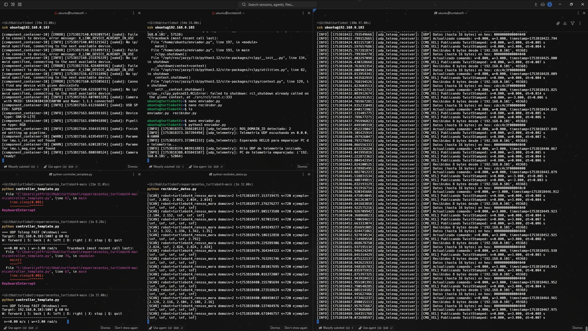

# Turtlebot4 🐢

## Tutorial

- Para prender: Enchufar a su puerto de carga (empieza a girar el LiDar)
- Para apagar: Mantenér pulsado el botón hasta que suene pupuru pupu

## Conexión al 🐢:

- Conectar la 💻 a la red (no tiene wifi):
  - RED: Lab_Computech_1_5G
  - PASS: Computech2025!
- El 🐢 se debería conectar solito a la red, hará un sonido de pupuru pu pu
  - 👀: Cuando la luz del botón de encendido se pone amarillo, hay un 50% de probabilidad que se haya conectado correctamente a la red.
- Ingresar a la web http://tplinkwifi.net
- Buscar la IP del turtlebot (Si hay varios, la IP se asigna en orden de conexión)
- Ingresar a la terminal en 💻:
  - `ssh ubuntu@192.168.0.{id_conexión}`
  - password: turtlebot4

## Configurar códigos 🐢 y 💻:

Las configuraciones deben coincidir tanto en el 🐢 como en la 💻 para que puedan comunicarse entre sí.

- En la terminal del 🐢:
  - `echo $ROS_DOMAIN_ID` -> Saldrá el ID del 🐢
  - Para cambiar: `export ROS_DOMAIN_ID=(numero entre 0 y 255)`

### Enviador ubuntu -> Recibidor win:

- Enviador ubuntu: [enviador.py](home/ubuntu/original/enviador.py)
  - `port` = 6000
  - `robot_name` = "turtlebot4_rensso_mora"
  - `pairing_code` = "ROBOT_A_2"

- Recibidor win: [recibidor_datos.py](win/original/recibidor_datos.py)
  - `ROBOT_IP` = "192.168.0.103"
  - `ROBOT_PORT` = 6000
  - `DESIRED_DOMAIN_ID` = 2
  - `PAIRING_CODE` = "ROBOT_A_2"
  - `EXPECTED_ROBOT_NAME` = "turtlebot4_rensso_mora"

### Enviador win -> Recibidor ubuntu:

- Enviador win: [controller_template.py](win/original/controller_template.py)
  - `ROBOT_IP` = "192.168.0.103"
  - `ROBOT_PORT` = 5007

- Recibidor ubuntu: [recibidor.py](home/ubuntu/original/recibidor.py)
  - `listen_ip` = "0.0.0.0"
  - `listen_port` = 5007

## Controlar el 🐢:

- Abrir 5 terminales: 3 conexiones al 🐢 por ssh y 2 terminales a 💻.
- 1ra terminal 🐢:
  - Ejecutar `ros2 launch turtlebot4_bringup lite.launch.py`
  - Si sale camera not detected, abrir el robot, desconectar y conectar la cámara
  - Éxito: Camera ready!
- 2da terminal 🐢:
  - Ejecutar enviador.py
- 3ra terminal 🐢:
  - Ejecutar recibidor.py
- 4ta terminal 💻:
  - Ejecutar recibidor_datos.py
- 5ta terminal 💻:
  - Ejecutar controller_template.py
  - Mover el 🐢 con WASD, Q para detenerse

Asi debería verse

> ⚠️: Si no funciona algo reiniciar el 🐢
> Si no funcinoa reiniciar, llamar a Cortijo
