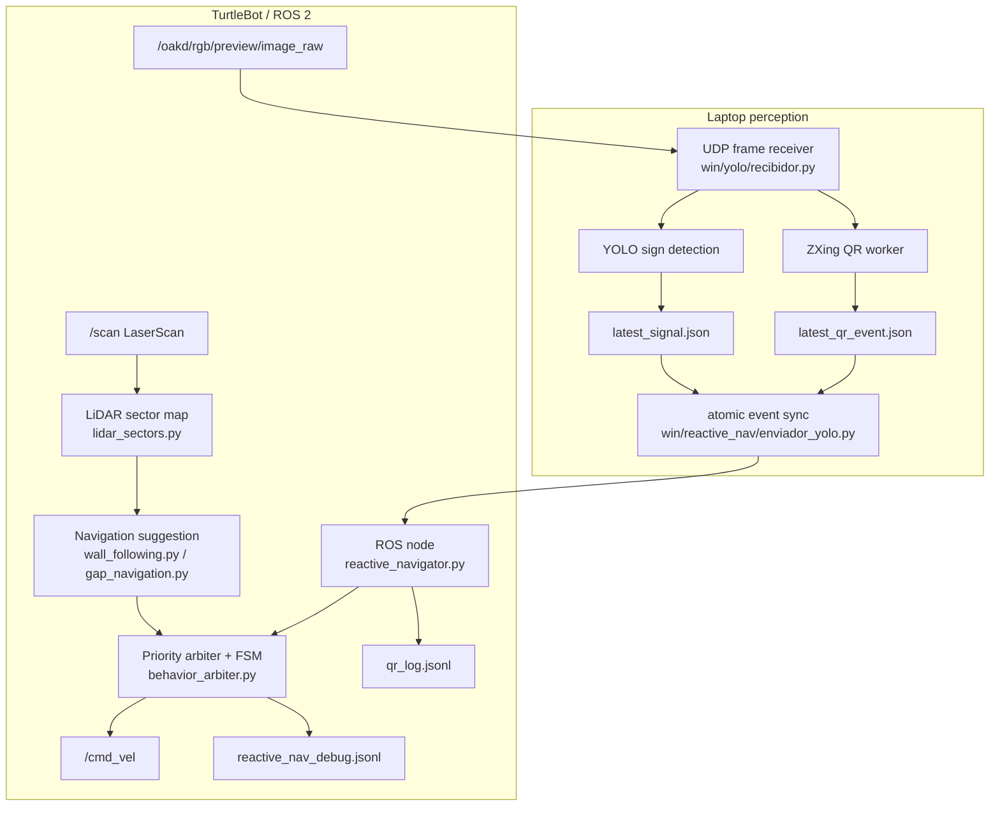

# Architecture

This project uses a modular reactive autonomy architecture for TurtleBot 4 Lite experiments. The design goal is to let perception, navigation, and safety logic evolve independently while preserving a single owner of wheel commands.

## Runtime split

## Main entry points

| Entry point | Side | Purpose |
| --- | --- | --- |
| `ubuntu/reactive_nav/reactive_navigator.py` | Robot | ROS 2 node that reads LiDAR, perception events, QR events, and publishes gated commands. |
| `ubuntu/reactive_nav/debug_image_udp_sender.py` | Robot | Sends camera frames to the laptop perception process. Does not publish motion. |
| `win/yolo/recibidor.py` | Laptop | Receives frames, runs YOLO sign detection, optionally runs ZXing QR detection, writes semantic JSON events. |
| `win/reactive_nav/enviador_yolo.py` | Laptop | Copies YOLO and QR JSON event files to the robot atomically. |
| `scripts/replay_nav_scenarios.py` | Local/offline | Replays deterministic LaserScan scenarios without ROS or robot hardware. |
| `scripts/evaluate_signal_fsm_dataset.py` | Local/offline | Evaluates sign detections through the FSM/actionability gates. |

## Data contracts

### LiDAR sectors

`lidar_sectors.py` converts `LaserScan` into a robust sector map:

- front center / front
- front-left / front-right
- left / right
- rear

Invalid values are filtered, ranges are clipped, and profiles can use a robust percentile rather than raw minimum. The sector map is passed to navigation modules and the arbiter.

### Navigation suggestion

Navigation modules return a suggested `TwistCommand` plus debug fields. They do not publish `/cmd_vel`, read YOLO, read QR, or override emergency safety.

Implemented backends include:

- wall following / corridor centering;
- gap-based recovery;
- experimental FOCM-style profile support.

### YOLO signal event

Laptop perception writes `output/signals/latest_signal.json` locally. The robot accepts it only if it is fresh, actionable, above confidence/area gates, centered enough, and confirmed by the sign debouncer.

### QR semantic event

Laptop perception writes `output/signals/latest_qr_event.json` only for validated QR events. The robot checks schema, validation status, event age, payload validity, and one-time event consumption before logging a checkpoint.

## Arbiter priority

The behavior arbiter applies this order:

1. Emergency LiDAR stop / collision prevention
2. Active maneuver completion, unless emergency stop is needed
3. QR scan/checkpoint registration behavior
4. Confirmed traffic-sign command
5. Default LiDAR navigation
6. Idle/stop if required sensors are missing or stale

This is the safety boundary of the system. YOLO and QR never directly drive wheels.

## Observability

The stack writes structured JSONL logs for:

- active FSM state and previous state;
- sector distances and freshness;
- requested versus published commands;
- arbiter vetoes and safety reasons;
- turn phase, direction, elapsed time, and completion reason;
- recovery entries, exits, and timeout candidates;
- YOLO/QR event freshness, actionability, and rejection reasons.

These logs are intentionally compatible with offline replay and failure extraction scripts.
